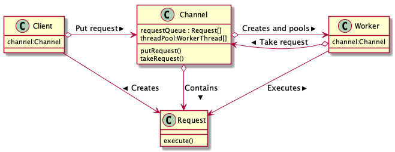

# Chap8

## Worker Thread pattern

### 介绍

WorkerThread 模式中，工作者线程会逐个取回工作并进行处理。当所有工作完成后，工人等待新的工作的到来。
WorkerThread 模式有时被称为Background thread (背景线程)模式，另外从“保存多个工作者线程的存储区”来看，也称这一模式为Thread pool（线程池）模式。

### 参与的角色

* Client : 创建表示工作请求的Request 角色并将其传递给Channel角色。

* Channel ：接收Request，并提供对外取request的方法。

* Worker ： 从Channel中取出Request，并进行处理，一项工作完成后继续取后续可用的Request。

* Request ： 保存了进行工作所必需的信息。

### 拓展

#### 提高吞吐量

如果可以将自己的工作交给别人用，那么自己就可以做下一项工作。线程也是一样的，如果将工作交给其它线程，自己就可以做下一项工作。这就是Thread-Per-Message模式的主题。

由于启动新线程需要花费时间，所以Worker Thread模式的主题之一就是通过轮流地和反复地使用线程来提高吞吐量。

#### 容量控制

Worker Thread模式的另一个主题，那就是可以同时提供的服务的数量，即容量的控制。

* Worker角色的数量

  Worker thread的数量越多，可以并发处理的也越多。但是当Worker角色的数量多于被请求工作的数量后，也不会对提高程序处理效率有什么帮助。过多的Worker角色会占用内存，所以需要根据程序实际运行的需要动态地调整Worker角色的数量。

  `java.util.concurrent.ThreadPoolExecutor`类是用于实际执行上面容量控制的类。

* Request角色
  
  Channel中可以保存着多个Request，当接收的request数量超出Worker的处理能力，request实例就会大量积累。这时，Client就会需要等一段时间后（出现了自调用`wait`）才能投递给Channel。

  同时注意到保存过多的Request实例会消耗大量的内存（特别的存储无限制或是阀值很大的情况）。

* 调用与执行的分离

  Client负责发送工作请求（Request），它将工作内容封装成Request实例，然后传给Channel。在普通的方法调用中，这部分相当于“设置参数并调用方法”。

  Worker则负责处理工作。它使用从Channel中接收到的Request实例来执行实际处理。在普通的方法调用中，这部分相当于“执行方法”。

  在普通的方法中，“调用方法”和“执行方法”是连续进行的，而无法分开。但是在Worker Thread 和 Thread-Per-Message模式中，方法的执行和调用（invocation VS. execution）是有意被分开的。注意到调用与执行的分离也是Command模式的主题内容之一。

  那么这样的分离有什么好处呢？

  1) 提高响应速度
   调用与执行不可分离的条件下，耗时的执行可能会成为瓶颈；但如果分离后再看，执行再耗时也没有关系。因为先行调用处理的一方完成后可以继续其它的处理，这样即可以提高响应速度。

  2) 控制执行顺利（调度）
   如果调用和执行是分离的情况下，执行就不受调用顺序的制约。可以通过设置Request的优先级，并控制Channel将Request传递给Worker的顺序来实现上述处理，即实现请求调度（scheduling）。

  3) 可以取消和反复执行
   调用和执行分离后，还可以实现“即使调用了也可以取消执行”的操作。
   由于调用结果是Request对象，所以将Request对象保存后还可以反复执行。

  4) 通往分布式之路
   将调用和执行分离后，可以负责将调用的计算机与负责执行的计算机分离开来。然后通过网络将Request对象从一台计算机传递至另一台计算机。

* `Runnable` 接口的意义

  java.lang.Runnable接口有时候会被用做WorkerThread中的Request角色，这样的Runnable对象可以用作方法参数传递，可以放入队列，跨越网络传输，也可以保存至文件中。同时也可以将Runnable接口看成GOF中的Command模式。

  常见的Java类库中的示例还有：

  * `javax.swing.SwingUtilities`类中的invokeLater方法接收Runnable对象类型的参数作为要进行的工作。

  * `java.util.Timer`类接收`java.util.TimerTask`类的实例作为要定时进行的工作，而TimerTask类实现了`Runnable` 接口。

  * `java.util.concurrent.Executor` 接口的execute方法接收`Runnable`对象类型的参数作为要进行的工作。

